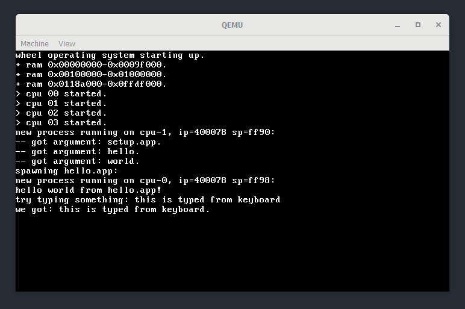

wheel operating system
======================

Wheel is an operating system, written mostly from scratch. Currently we support 64-bit Intel/AMD architecture.

Some features of wheel:

- multi-tasking (kernel mode and user mode)
- fixed-priority preemptive scheduling
- round-robin scheduling amongst tasks of the same priority
- support for symmetric multiprocessing (SMP)
- dynamic load balancing across each CPUs
- ELF program loading (no dynamic linking)

Required tools and softwares:

- Linux/Unix environment, WSL (Windows Subsystem for Linux) also works.
- GCC cross compiler and binutils for x86_64 target, i.e. `x86_64-elf-gcc`.
- `grub`, `xorriso` and `mtools` to make bootable iso image (also install `grub-pc-bin` on EFI systems).
- `qemu` (or other virtual machine) to run the system.

To build and run wheel:

- `make` to generate kernel image `bin/wheel.bin`.
- `make iso` to create ISO image `bin/wheel.iso`.
- `make run` to run the OS with QEMU.
- `make clean` to delete all generated files.

References:

- [GCC Cross-Compiler](https://wiki.osdev.org/GCC_Cross-Compiler)
- [Libgcc without red zone](https://wiki.osdev.org/Libgcc_without_red_zone)
